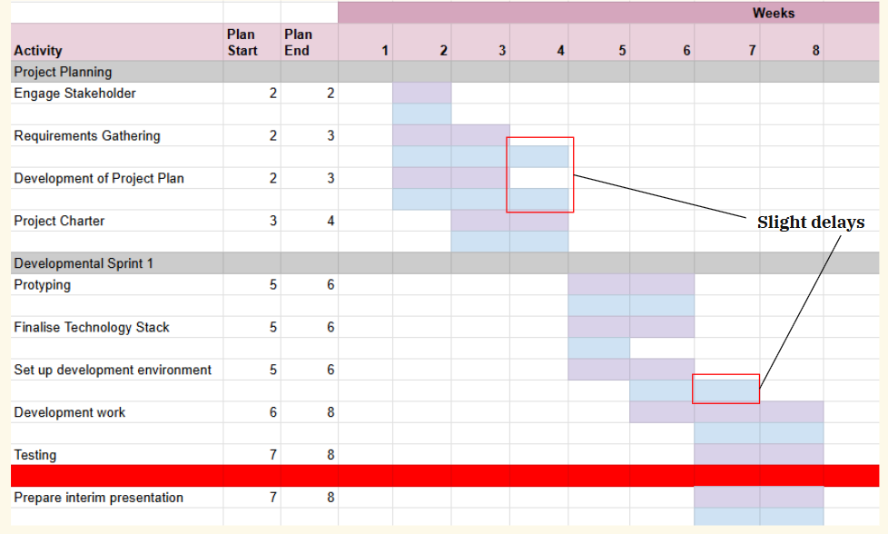
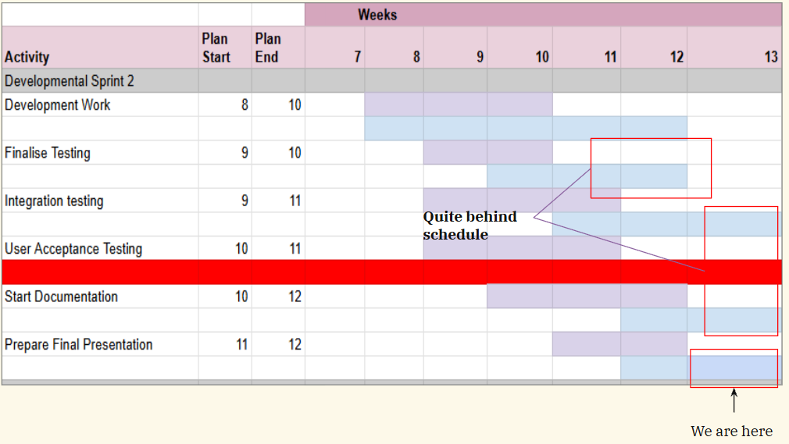
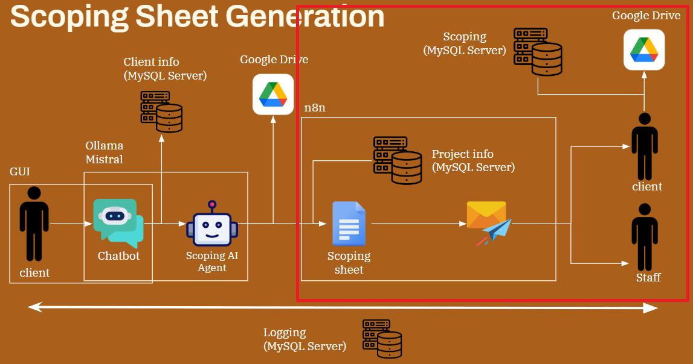
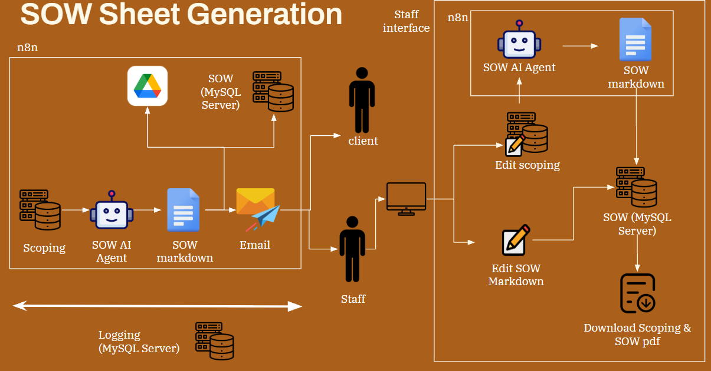
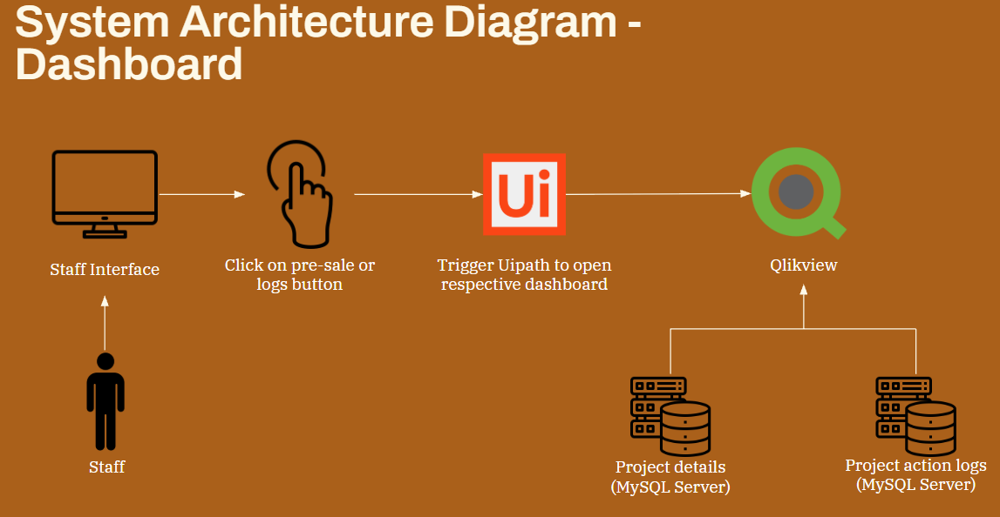
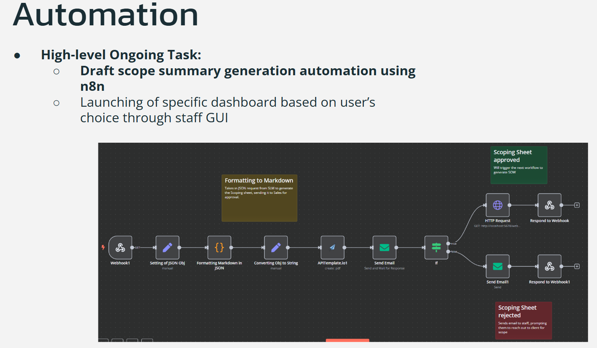
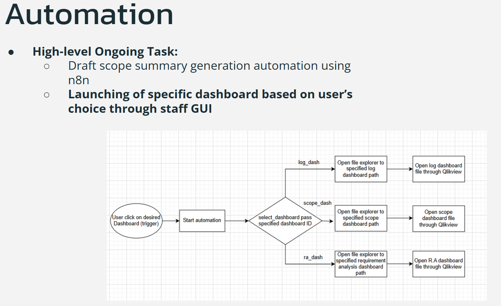

# Capstone_AgenticAI_Presales_Automation

Note: This repository only contains my portion of the project. The project was done by a team of 5 people.

## Background
This project aimed to improve the existing pre-sales process, where client requirements and project details were passed between the sales team, tech pre-sales team, and project manager through manual communication. This created risks such as missing information, delays in handovers, and limited visibility into process performance. Most importantly, the generation of both the draft scoping sheet and the Statement-of-Work (SoW) is affected. The goal was to streamline information flow, reduce manual coordination, and make the pre-sales journey easier to track and monitor.

As a developer, my contribution was related to automation development, using both Agentic AI (n8n) and RPA (UiPath). n8n was used for processes that requires a lot more API calls including interactions with the LLM (Ollama Mistral). Uipath was used for processes that requires navigating through local file structures. 

As a Project Manager, I oversee the direction and the progress of the project through SCRUM methodologies. 

## Process
The project was broken down into 3 main processes: Scope generation, SoW generation, and Dashboarding. 
My portion of the work has been indicated in red.

### Scoping Sheet Flow
I broke it down into 3 parts: Formatting to Markdown, Scoping Sheet Approved, Scoping Sheet Rejected

1. Formatting to Markdown
The collated response from the chatbot would be received as a JSON object. The object gets formatted into Markdown to be used on a Scoping Sheet template on APITemplate. After generating the Scoping sheet, it would be emailed to client for approval.

2. Scoping Sheet Approved
If the draft has been approved, it would trigger the SOW workflow.

3. Scoping Sheet Rejected
If the draft has been rejected, it would send an email to the staff, prompting them to reach out to the client (Human intervention).

### Dashboard Flow

